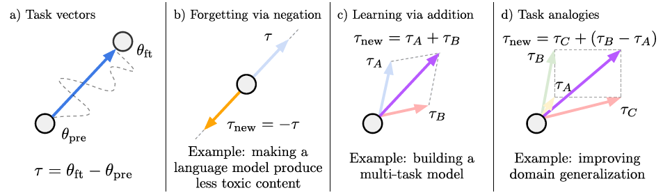
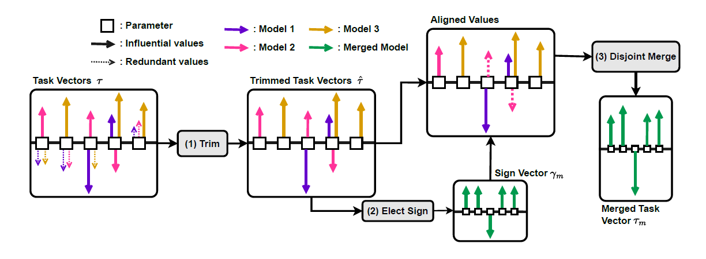
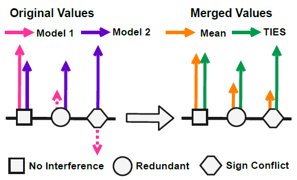

# Model Merging 
Model Merging is a cutting-edge technique that integrates multiple large language models (LLMs) into a single, cohesive model. This approach allows for the combination of models with different architectures, such as LLaMA 2, Mistral, and Wizard, to harness the strengths of each.

>It’s feasible to merge models with mixing architectures, for example: LLaMA 2 + Mistral + Wizard.

- We can pick the best of both worlds say computer vision and NLP and merge into one. It saves a lot of time instead creating a different architecture for each use case, you only have
to maintain one.
## Merge Algorithm
### 1. EDITING MODELS WITH TASK ARITHMETIC 
- Negating a task vector
  - Forgetting via negation  $\tau_{\text{new}} = -\tau$ corresponds to extrapolating
between the fine-tuned model and the pre-trained model.
- Adding a task vector
  - $\tau_{\text{new}} = \sum_{i} \tau_i$ results in a multi-task model proficient in all tasks, sometimes even
with gains over models fine-tuned on individual tasks.
- Combining a task vector

This study dives deep into the intricate workings of task vectors within pre-trained models, shedding light on their potential to steer model behavior effectively. By constructing task vectors through the contrast of pre- and post-fine-tuning model weights, the research unveils a powerful mechanism for task optimization.

One of the most intriguing aspects is how arithmetic operations like negation and addition can manipulate these task vectors, directly influencing task performance. The revelation that negating a task vector decreases performance while leaving control tasks relatively unaffected highlights the precision with which these vectors can be tuned.

Even more exciting is the discovery that combining task vectors through addition can lead to enhanced performance across multiple tasks simultaneously. This not only underscores the versatility of task vectors but also hints at the possibility of more efficient multitask learning strategies.

Perhaps the most remarkable finding is the application of task vector combinations in tasks linked by analogy relationships. The ability to leverage task vectors from related tasks to improve performance on a fourth task, without any direct training data, opens up a realm of possibilities for transfer learning and generalization.

Firstly, we define **wpre** as the weights of a pre-trained model, and **wft** as the corresponding weights after fine-tuning on task *t*. The task vector **vt** is essentially the difference between these two sets of weights, calculated element-wise: **vt** = **wft** - **wpre**.

Now, the interesting part is how these task vectors can be applied to other model parameters $\mathbf{w}$ of the same architecture. This is achieved through element-wise addition, with an optional scaling factor $\lambda$, resulting in a new set of weights $\mathbf{w}_{\text{new}} = \mathbf{w} + \lambda \mathbf{v}$.

## **1. TIES-MERGING (TRIM, ELECT SIGN & MERGE):** Introduces three novel approaches to solve these problems.

1. **Trim:** For each task $( t )$, we trim the redundant parameters from the task vector $\tau_t$ to create $\hat{\tau}_t$
 by keeping the top-\( k \)% values according to their magnitude and trimming the bottom \( 100 - k \)% of the redundant parameters by resetting them to 0. This can be decomposed further as $\tau_t = \hat{\gamma}_t \odot \hat{\mu}_t$
 .

2. **Elect:** Next, we create an aggregate elected sign vector $\gamma_m$ for the merged model that resolves the disagreements in the sign for each parameter $( p )$ across different models. To create the elected sign vector, we choose the sign with the highest total magnitude across all relevant models. For each parameter $p \in \{1, 2, \ldots, d\}$
, we separate the values based on their sign $(+1) or (-1)$ and take their sum to calculate the total mass (i.e., total magnitude) in the positive and negative direction. We then assign $( \gamma_{pm} )$ as the sign with greater total movement. This can be efficiently computed using $( \gamma_{pm} = \text{sgn}\left(\sum_{t=1}^n \hat{\tau}^p_t\right) )$.

4. **Disjoint Merge:** Then, for each parameter $( p )$, we compute a disjoint mean by only keeping the parameter values from the models whose signs are the same as the aggregated elected sign and calculate their mean. Formally, let $( A_p = \{t \in [n] \,|\, \hat{\gamma}^p_t = \gamma_{pm}\} )$, then $( \tau_{pm} = \frac{1}{|A_p|} \sum_{t \in A_p} \hat{\tau}^p_t )$. Note that the disjoint mean always ignores the zero values.

Given the final merged task vector $( \tau_m )$, we scale it and add it to the initial parameter values to obtain the merged model parameters $( \theta_m )$ as $( \theta_m = \theta_{\text{init}} + \lambda \cdot \tau_m )$, where $( \lambda )$ is a scaling hyperparameter.

>Depiction of steps involved.

### INTERFERENCE FROM REDUNDANT PARAMETERS
- However, when merging
a parameter that is influential for one model but redundant
(i.e. not influential) for other models, the
influential value may be obscured by the redundant
values, lowering the overall model performance
- INTERFERENCE FROM SIGN DISAGREEMENT: A given parameter might have a positive
value for some models and a negative value for others. Consequently, employing simple averaging
might compromise the performance on both tasks.

Read more about the algorithm [here](https://arxiv.org/pdf/2306.01708)

## Similar to TIES below are the most common used algorithm for model merging.
- SLERP
- DARE
- Passthrough

# Arcee’s MergeKit: A Toolkit for Merging Large Language Models
[Paper](https://arxiv.org/pdf/2403.13257)

### [arceee.ai](https://www.arcee.ai/ ) has made it very feasible to merge LLM based on above algorithms.
#### Here is the repo for [GitHub Repo](https://github.com/arcee-ai/mergekit)

